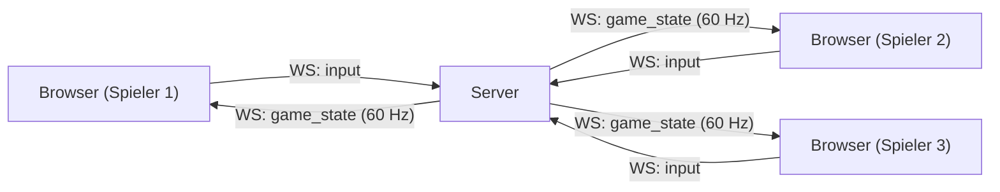
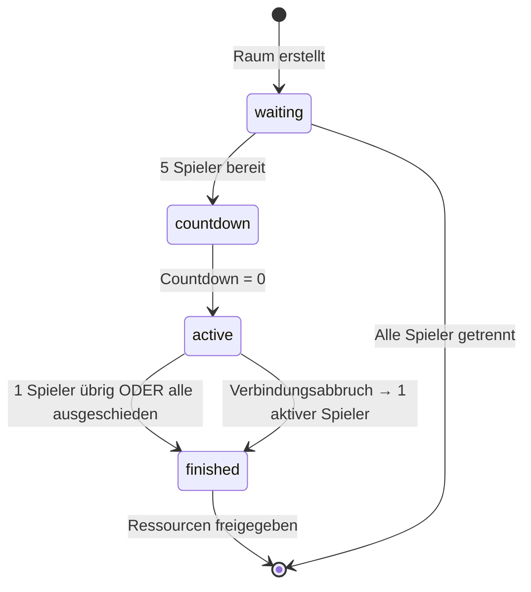

# Design-Dokument: Curve Racer Multiplayer

## Übersicht

Curve Racer Multiplayer erweitert das bestehende Einzelspieler-Browserspiel um einen Echtzeit-Mehrspielermodus für bis zu 5 Spieler pro Raum. Die Architektur folgt dem server-autoritativen Modell: Der Server führt die gesamte Spielphysik aus, Clients senden ausschließlich Eingaben und rendern den empfangenen Zustand.

Die bestehende Physik aus `game/index.html` wird 1:1 auf den Server portiert. Der Client wird um Netzwerkschicht, Warteraum und Mehrspielermodus-Rendering erweitert, ohne die Einzelspieler-Logik zu verändern.



---

## Architektur

### Systemkomponenten

```
curve-racer-multiplayer/
├── game/
│   └── index.html          # Bestehender Einzelspieler-Client (unverändert)
├── server/
│   ├── index.js            # Einstiegspunkt, HTTP + WebSocket-Server
│   ├── matchmaking.js      # Warteschlange und Raumzuweisung
│   ├── room.js             # Spielraum-Instanz (Zustandsmaschine + Spielschleife)
│   └── physics.js          # Portierte Physik aus index.html
└── client/
    └── multiplayer.html    # Multiplayer-Client (Warteraum + Spielrendering)
```

### Schichtenmodell

```
┌─────────────────────────────────────────────┐
│  Client (Browser)                           │
│  ┌──────────────┐  ┌──────────────────────┐ │
│  │  UI-Schicht  │  │  Rendering-Schicht   │ │
│  │  (Menü, HUD, │  │  (Canvas, Trail,     │ │
│  │   Warteraum) │  │   Spielerpunkte)     │ │
│  └──────┬───────┘  └──────────┬───────────┘ │
│         │                     │             │
│  ┌──────▼─────────────────────▼───────────┐ │
│  │         WebSocket-Client               │ │
│  └──────────────────┬─────────────────────┘ │
└─────────────────────│───────────────────────┘
                      │ WebSocket (ws://)
┌─────────────────────│───────────────────────┐
│  Server (Node.js)   │                       │
│  ┌──────────────────▼─────────────────────┐ │
│  │         WebSocket-Server (ws)          │ │
│  └──────────────────┬─────────────────────┘ │
│         ┌───────────▼──────────┐            │
│         │     Matchmaking      │            │
│         └───────────┬──────────┘            │
│         ┌───────────▼──────────┐            │
│         │   Room (pro Raum)    │            │
│         │  ┌────────────────┐  │            │
│         │  │  Spielschleife │  │            │
│         │  │  (60 Hz)       │  │            │
│         │  └────────┬───────┘  │            │
│         │  ┌────────▼───────┐  │            │
│         │  │    Physics     │  │            │
│         │  └────────────────┘  │            │
│         └──────────────────────┘            │
└─────────────────────────────────────────────┘
```

### Designentscheidungen

- **Server-autoritativ**: Alle Physikberechnungen laufen auf dem Server. Clients sind reine Renderer. Verhindert Cheating und Desynchronisation.
- **Kein Client-Side Prediction**: Aufgrund der einfachen Physik und der 60-Hz-Rate ist Latenz tolerierbar. Vereinfacht die Implementierung erheblich.
- **Zustandsmaschine pro Raum**: Jeder Spielraum durchläuft klar definierte Zustände (wartend → countdown → aktiv → beendet). Verhindert ungültige Zustandsübergänge.
- **Globale Warteschlange**: Eine einzige Warteschlange für alle Spieler. Einfachstes Matchmaking für den Anfang.
- **Trail-Komprimierung**: Trails werden als Array der letzten N Punkte übertragen. Der Server begrenzt die Trail-Länge auf 300 Punkte (wie im Einzelspieler).
- **Hosting**: Render (kostenloser Tier). Der Server schläft nach 15 Minuten Inaktivität ein und startet beim nächsten Verbindungsversuch neu (30–60 Sekunden Kaltstart). Für ein Hobbyprojekt akzeptabel.

---

## Komponenten und Schnittstellen

### WebSocket-Nachrichtenprotokoll

Alle Nachrichten sind JSON-kodiert. Jede Nachricht hat ein `type`-Feld.

#### Client → Server

```
┌─────────────────────────────────────────────────────┐
│ join_queue                                          │
│ { type: "join_queue" }                              │
│ Spieler tritt der globalen Warteschlange bei        │
├─────────────────────────────────────────────────────┤
│ leave_queue                                         │
│ { type: "leave_queue" }                             │
│ Spieler verlässt die Warteschlange                  │
├─────────────────────────────────────────────────────┤
│ input                                               │
│ { type: "input", direction: "left"|"right"|"none" } │
│ Aktueller Tastenzustand des Spielers                │
└─────────────────────────────────────────────────────┘
```

#### Server → Client

```
┌──────────────────────────────────────────────────────────────────┐
│ queue_update                                                     │
│ { type: "queue_update", count: number }                          │
│ Aktuelle Anzahl wartender Spieler                                │
├──────────────────────────────────────────────────────────────────┤
│ game_init                                                        │
│ {                                                                │
│   type: "game_init",                                             │
│   playerId: string,                                              │
│   players: PlayerInit[],                                         │
│   obstacles: Obstacle[],                                         │
│   mapWidth: number,                                              │
│   mapHeight: number                                              │
│ }                                                                │
│ Startdaten: Karte, Hindernisse, Startpositionen aller Spieler    │
├──────────────────────────────────────────────────────────────────┤
│ countdown                                                        │
│ { type: "countdown", value: number }   // 3, 2, 1, 0            │
│ Countdown-Tick (0 = Spiel startet)                               │
├──────────────────────────────────────────────────────────────────┤
│ game_state                                                       │
│ {                                                                │
│   type: "game_state",                                            │
│   tick: number,                                                  │
│   players: PlayerState[],                                        │
│   activeCount: number,                                           │
│   elapsedMs: number                                              │
│ }                                                                │
│ Vollständiger Spielzustand nach jedem Tick (60 Hz)               │
├──────────────────────────────────────────────────────────────────┤
│ game_over                                                        │
│ {                                                                │
│   type: "game_over",                                             │
│   winnerId: string | null,                                       │
│   elapsedMs: number                                              │
│ }                                                                │
│ Spielende: Gewinner-ID oder null bei Unentschieden               │
├──────────────────────────────────────────────────────────────────┤
│ error                                                            │
│ { type: "error", code: string, message: string }                 │
│ Fehlermeldung (z. B. Verbindungsfehler, Raumfehler)              │
└──────────────────────────────────────────────────────────────────┘
```

### Matchmaking-Modul (`matchmaking.js`)

```
Interface Matchmaking:
  addPlayer(ws, playerId)   → void
  removePlayer(playerId)    → void
  getQueueCount()           → number
  onRoomReady(callback)     → void  // callback(players[])
```

Logik: Sobald 5 Spieler in der Warteschlange sind, wird `onRoomReady` ausgelöst und alle 5 Spieler werden aus der Warteschlange entfernt.

### Room-Modul (`room.js`)

```
Interface Room:
  constructor(players, mapWidth, mapHeight)
  start()         → void
  destroy()       → void
  getState()      → RoomState
```

Zustandsmaschine:



### Physics-Modul (`physics.js`)

Portierte Konstanten und Funktionen aus `game/index.html`:

```javascript
// Konstanten (identisch mit Einzelspieler)
const TURN_RATE    = 4.5;
const ACCEL_FACTOR = Math.LN2 / 8;
const DECEL_FACTOR = Math.LN2 / 5;
const MIN_SPEED    = 100;
const MAX_SPEED    = 3000;
const PRADIUS      = 14;

// Exportierte Funktionen
tickPlayer(player, input, dt)        → PlayerState
checkCollisions(players, obstacles)  → CollisionResult[]
circleRect(cx, cy, r, rx, ry, rw, rh) → boolean
randomObstacles(width, height)       → Obstacle[]
safeStartPositions(count, obstacles, width, height) → Position[]
```

---

## Datenmodelle

### Spieler-Initialisierungsdaten (`PlayerInit`)

```typescript
interface PlayerInit {
  id: string;          // UUID
  colorHex: string;    // z. B. "#e74c3c"
  x: number;
  y: number;
  angle: number;       // Startwinkel in Radiant
}
```

### Spielerzustand (`PlayerState`)

```typescript
interface PlayerState {
  id: string;
  x: number;
  y: number;
  angle: number;
  speed: number;
  maxSpeed: number;    // Höchstgeschwindigkeit dieser Runde
  trail: TrailPoint[]; // Letzte ≤300 Punkte
  alive: boolean;
}

interface TrailPoint {
  x: number;
  y: number;
}
```

### Hindernis (`Obstacle`)

```typescript
interface Obstacle {
  x: number;
  y: number;
  w: number;  // Breite: 20–240 px
  h: number;  // Höhe: 15–175 px
}
```

### Spielzustand (`GameState`, server-intern)

```typescript
interface GameState {
  roomId: string;
  status: "waiting" | "countdown" | "active" | "finished";
  tick: number;
  startedAt: number | null;   // Unix-Timestamp ms
  players: Map<string, ServerPlayer>;
  obstacles: Obstacle[];
  mapWidth: number;
  mapHeight: number;
}

interface ServerPlayer {
  id: string;
  ws: WebSocket;
  colorHex: string;
  x: number;
  y: number;
  angle: number;
  speed: number;
  maxSpeed: number;
  trail: TrailPoint[];
  alive: boolean;
  lastInput: "left" | "right" | "none";
}
```

### Spielergebnis (`GameResult`)

```typescript
interface GameResult {
  winnerId: string | null;  // null = Unentschieden
  elapsedMs: number;
}
```

---

## Korrektheitseigenschaften

*Eine Eigenschaft ist ein Merkmal oder Verhalten, das bei allen gültigen Ausführungen eines Systems gelten soll – im Wesentlichen eine formale Aussage darüber, was das System tun soll. Eigenschaften dienen als Brücke zwischen menschenlesbaren Spezifikationen und maschinell verifizierbaren Korrektheitsnachweisen.*


### Eigenschaft 1: Warteschlangen-Zähler-Invariante

*Für jeden* Spieler, der `join_queue` sendet, muss der serverseitige Warteschlangen-Zähler um genau 1 steigen. Für jeden Spieler, der die Verbindung trennt oder `leave_queue` sendet, muss der Zähler um genau 1 sinken. Der Zähler darf nie negativ werden.

**Validiert: Anforderungen 2.1, 2.5**

---

### Eigenschaft 2: Matchmaking-Schwellenwert

*Für jede* Sequenz von `join_queue`-Ereignissen, die den Warteschlangen-Zähler auf genau 5 bringt, muss der Server genau einen neuen Spielraum erstellen und alle 5 Spieler aus der Warteschlange entfernen. Nach der Raumzuweisung muss der Zähler 0 betragen.

**Validiert: Anforderungen 2.3**

---

### Eigenschaft 3: Hindernisgeneration

*Für jede* generierte Karte mit Breite W und Höhe H müssen alle platzierten Hindernisse (a) vollständig innerhalb der Kartengrenzen liegen, (b) sich nicht gegenseitig überlappen (mit einem Mindestabstand von 20 px), und (c) darf die Anzahl der Hindernisse 20 nicht überschreiten.

**Validiert: Anforderungen 2.4, 3.1**

---

### Eigenschaft 4: Zustandsübergang nach Countdown

*Für jeden* Spielraum, der den Countdown-Wert 0 erreicht, muss der Raumstatus von `"countdown"` zu `"active"` wechseln. Kein anderer Zustandsübergang darf diesen Schritt überspringen.

**Validiert: Anforderungen 3.4**

---

### Eigenschaft 5: Eingaben nur im aktiven Spielzustand

*Für jede* Eingabenachricht, die außerhalb des `"active"`-Zustands (d. h. während `"countdown"`, `"waiting"`, `"finished"` oder nach dem Ausscheiden des Spielers) empfangen wird, darf diese Eingabe keinen Einfluss auf den Spielzustand haben.

**Validiert: Anforderungen 3.5, 5.2, 6.3**

---

### Eigenschaft 6: Physik-Korrektheit – Geschwindigkeitsupdate

*Für jeden* Spieler und jedes Tick mit Zeitdelta `dt`: Wenn der Spieler keine Taste drückt, muss die neue Geschwindigkeit `speed * exp(ACCEL_FACTOR * dt)` betragen (begrenzt auf MAX_SPEED). Wenn der Spieler lenkt, muss die neue Geschwindigkeit `speed * exp(-DECEL_FACTOR * dt)` betragen (begrenzt auf MIN_SPEED).

**Validiert: Anforderungen 4.4**

---

### Eigenschaft 7: Physik-Korrektheit – Wendekreis

*Für jeden* Spieler, der lenkt, muss die Winkeländerung pro Tick `TURN_RATE / (1 + (speed/300)² * 8) * dt` betragen. Der Wendekreis wächst damit quadratisch mit der Geschwindigkeit.

**Validiert: Anforderungen 4.4**

---

### Eigenschaft 8: Spieler-Spieler-Kollisionsregel

*Für jedes* Paar von Spielern, deren Abstand kleiner als `2 * PRADIUS` ist: Der Spieler mit der niedrigeren Geschwindigkeit wird als `alive: false` markiert. Der Spieler mit der höheren Geschwindigkeit überlebt und seine Geschwindigkeit wird halbiert. Bei Gleichstand scheiden beide aus.

**Validiert: Anforderungen 4.5**

---

### Eigenschaft 9: Spieler-Hindernis-Kollisionsregel

*Für jeden* Spieler, dessen Position einen Kreis mit Radius `PRADIUS` bildet, der ein Hindernis-Rechteck berührt (gemäß `circleRect`), muss dieser Spieler als `alive: false` markiert werden.

**Validiert: Anforderungen 4.6**

---

### Eigenschaft 10: Eingabe-Persistenz

*Für jeden* Tick, in dem kein neues `input`-Paket eines Spielers eingetroffen ist, muss der Server die zuletzt bekannte Eingabe dieses Spielers verwenden (Standard: `"none"` bei erster Verbindung).

**Validiert: Anforderungen 5.3**

---

### Eigenschaft 11: Ausgeschiedene Spieler erhalten weiterhin Zustandsupdates

*Für jeden* Spieler, der als `alive: false` markiert wurde, muss der Server weiterhin `game_state`-Nachrichten an dessen WebSocket-Verbindung senden, bis das Spiel endet (`game_over` gesendet wird).

**Validiert: Anforderungen 6.1, 6.4**

---

### Eigenschaft 12: Spielende bei einem aktiven Spieler

*Für jeden* Spielzustand, in dem genau 1 Spieler `alive: true` ist, muss der Server in diesem Tick das Spiel beenden, den verbleibenden Spieler als Gewinner setzen und `game_over` mit dessen ID an alle Clients senden.

**Validiert: Anforderungen 7.1, 8.3**

---

### Eigenschaft 13: Unentschieden-Bedingung

*Für jeden* Spielzustand, in dem 0 Spieler `alive: true` sind, muss der Server das Spiel als Unentschieden beenden und `game_over` mit `winnerId: null` an alle Clients senden.

**Validiert: Anforderungen 7.2**

---

### Eigenschaft 14: Raumbereinigung bei vollständigem Verbindungsabbruch

*Für jeden* Spielraum, in dem alle Spieler die Verbindung getrennt haben, müssen alle Ressourcen des Raums (Spielschleife, Timer, Referenzen) freigegeben werden.

**Validiert: Anforderungen 8.4**

---

### Eigenschaft 15: HUD-Datenkorrektheit

*Für jede* empfangene `game_state`-Nachricht muss der Client die angezeigten Werte (Geschwindigkeit, Höchstgeschwindigkeit, Spielzeit, Anzahl aktiver Spieler) exakt aus den entsprechenden Feldern der Nachricht übernehmen.

**Validiert: Anforderungen 9.1, 9.2, 9.3, 9.4**

---

### Eigenschaft 16: Raumisolation

*Für je zwei* gleichzeitig aktive Spielräume R1 und R2 darf kein Ereignis in R1 (Spielerzug, Kollision, Verbindungsabbruch) den Spielzustand von R2 verändern. Jeder Raum verwaltet seinen eigenen unabhängigen Zustand.

**Validiert: Anforderungen 10.4, 10.5**

---

## Fehlerbehandlung

### Verbindungsfehler

| Szenario | Verhalten |
|---|---|
| WebSocket-Verbindung schlägt fehl (Client) | Fehlermeldung anzeigen, im Hauptmenü bleiben |
| Spieler trennt Verbindung in Warteschlange | Aus Warteschlange entfernen, `queue_update` an alle senden |
| Spieler trennt Verbindung im Countdown | Als ausgeschieden markieren, Countdown läuft weiter |
| Spieler trennt Verbindung im aktiven Spiel | Als `alive: false` markieren, Spielende-Prüfung auslösen |
| Alle Spieler trennen Verbindung | Spielraum schließen, Ressourcen freigeben |

### Server-Fehler

| Szenario | Verhalten |
|---|---|
| Unbehandelter Fehler in Spielraum | `error`-Nachricht an alle Clients des Raums, Raum schließen |
| Fehler in Matchmaking | Betroffene Clients benachrichtigen, andere Räume unberührt |
| Ungültige Nachricht vom Client | Nachricht ignorieren, Verbindung offen lassen |

### Fehler-Codes

```
ROOM_ERROR       – Unbehandelter Fehler im Spielraum
CONNECTION_LOST  – Verbindung zum Server unterbrochen
INVALID_MESSAGE  – Ungültiges Nachrichtenformat
```

---

## Teststrategie

### Dualer Testansatz

Die Teststrategie kombiniert Unit-Tests für konkrete Beispiele und Eigenschafts-Tests für universelle Korrektheit.

**Unit-Tests** decken ab:
- Spezifische Beispiele (z. B. genau 5 Spieler lösen Raumzuweisung aus)
- Integrationspunkte (z. B. WebSocket-Nachrichtenformat)
- Randfälle (z. B. gleichzeitige Kollision zweier Spieler)
- Fehlerbedingungen (z. B. Verbindungsabbruch während Countdown)

**Eigenschafts-Tests** decken ab:
- Physik-Korrektheit über viele zufällige Eingaben
- Kollisionsregeln für beliebige Geschwindigkeitskombinationen
- Warteschlangen-Invarianten für beliebige Join/Leave-Sequenzen
- Raumisolation für beliebige gleichzeitige Raumkonfigurationen

### Eigenschafts-Test-Bibliothek

**Sprache**: JavaScript/Node.js  
**Bibliothek**: [`fast-check`](https://github.com/dubzzz/fast-check)

```bash
npm install --save-dev fast-check
```

Jeder Eigenschafts-Test läuft mit mindestens **100 Iterationen** (fast-check Standard: 100).

### Test-Tagging

Jeder Eigenschafts-Test wird mit einem Kommentar versehen:

```javascript
// Feature: curve-racer-multiplayer, Eigenschaft 6: Physik-Korrektheit – Geschwindigkeitsupdate
test('speed update follows physics formula', () => {
  fc.assert(fc.property(
    fc.record({ speed: fc.float({ min: 100, max: 3000 }), dt: fc.float({ min: 0.001, max: 0.05 }) }),
    ({ speed, dt }) => {
      const result = tickPlayer({ speed, angle: 0, x: 400, y: 300 }, 'none', dt);
      const expected = Math.min(MAX_SPEED, speed * Math.exp(ACCEL_FACTOR * dt));
      return Math.abs(result.speed - expected) < 0.001;
    }
  ));
});
```

### Zuordnung Eigenschaften → Tests

| Eigenschaft | Test-Datei | Typ |
|---|---|---|
| E1: Warteschlangen-Zähler | `matchmaking.test.js` | Eigenschaft |
| E2: Matchmaking-Schwellenwert | `matchmaking.test.js` | Eigenschaft |
| E3: Hindernisgeneration | `physics.test.js` | Eigenschaft |
| E4: Zustandsübergang Countdown | `room.test.js` | Eigenschaft |
| E5: Eingaben nur im aktiven Zustand | `room.test.js` | Eigenschaft |
| E6: Physik – Geschwindigkeit | `physics.test.js` | Eigenschaft |
| E7: Physik – Wendekreis | `physics.test.js` | Eigenschaft |
| E8: Spieler-Spieler-Kollision | `physics.test.js` | Eigenschaft |
| E9: Spieler-Hindernis-Kollision | `physics.test.js` | Eigenschaft |
| E10: Eingabe-Persistenz | `room.test.js` | Eigenschaft |
| E11: Zustand an ausgeschiedene Spieler | `room.test.js` | Eigenschaft |
| E12: Spielende bei 1 Spieler | `room.test.js` | Eigenschaft |
| E13: Unentschieden | `room.test.js` | Eigenschaft |
| E14: Raumbereinigung | `room.test.js` | Eigenschaft |
| E15: HUD-Datenkorrektheit | `client.test.js` | Eigenschaft |
| E16: Raumisolation | `matchmaking.test.js` | Eigenschaft |
| Hauptmenü-Button | `client.test.js` | Beispiel |
| WebSocket-Verbindungsfehler | `client.test.js` | Beispiel |
| Countdown-Sequenz | `room.test.js` | Beispiel |
| Ergebnisbildschirm-Buttons | `client.test.js` | Beispiel |
| PORT-Umgebungsvariable | `server.test.js` | Beispiel |
